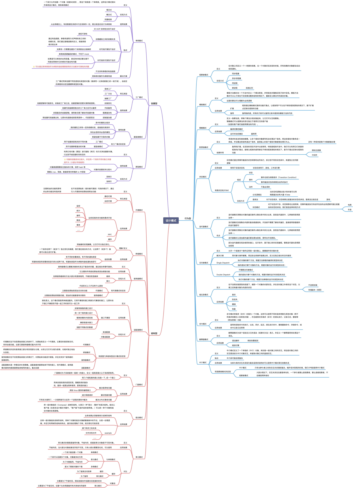

# go-design-pattern

## 总结

学习设计模式我们究竟需要学习一些什么？
-   写 Go 需要使用到设计模式么？
    -   需要，但是切记请勿使用其他语言的方式来写 Go
    -   如果看过之前的一些文章，就会发现类似 JAVA 的这些面向对象语言中的某些设计模式的写法在 Go 中会十分的别扭
    -   但是 Go 不需要设计模式么？不是的，设计模式的思想是想通的，并且我们一直都在使用，例如我们常见的对象创建方式 `NewXXX` 这其实就是一个简单工厂
-   设计模式学习的重点是什么？
    -   设计原则，以及设计模式的使用场景和优缺点，实现相对来说还没有那么重要
    -   如果是常见的设计模式是武术招式，那么设计原则就是内功心法，没有内功心法那么招式套路也就是花架子
    -   熟练掌握不同设计模式的使用场景可以帮助我们学会见招拆招，灵活应用而不是只会套路
-   **最后设计模式不是银弹，不要拿着🔨就觉得哪里都像是钉子，不要过早优化，持续重构才是正道**

### 设计原则

> 同时这也是 Code Review 的重要标准之一

 
点击展开设计原则

 

### 设计模式

 
点击展开设计模式

 

## Go设计模式

-   单例模式包含饿汉式和懒汉式两种实现
-   工厂模式包含简单工厂、工厂方法、抽象工厂、DI容器
-   代理模式包含静态代理、动态代理（采用 go generate 模拟）
-   观察者模式包含观察者模式、eventbus

|  **类型**  |                                                   **设计模式（Github）**                                                   | **常用** |
| :--------: |:--------------------------------------------------------------------------------------------------------------------:| :------: |
| **创建型** |      [单例模式(Singleton Design Pattern)](https://github.com/zkep/learn-go/tree/master/design-pattern/01_singleton)      |    ✅     |       
|            |        [工厂模式(Factory Design Pattern)](https://github.com/zkep/learn-go/tree/master/design-pattern/02_factory)         |    ✅     |         
|            |        [建造者模式(Builder Design Pattern)](https://github.com/zkep/learn-go/tree/master/design-pattern/03_builder)        |    ✅     |       
|            |      [原型模式(Prototype Design Pattern)](https://github.com/zkep/learn-go/tree/master/design-pattern/04_prototype)       |    ❌     |           
| **结构型** |          [代理模式(Proxy Design Pattern)](https://github.com/zkep/learn-go/tree/master/design-pattern/05_proxy)           |    ✅     | 
|            |         [桥接模式(Bridge Design Pattern)](https://github.com/zkep/learn-go/tree/master/design-pattern/06_bridge)          |    ✅     |           
|            |      [装饰器模式(Decorator Design Pattern)](https://github.com/zkep/learn-go/tree/master/design-pattern/07_decorator)      |    ✅     |         
|            |        [适配器模式(Adapter Design Pattern)](https://github.com/zkep/learn-go/tree/master/design-pattern/08_adapter)        |    ✅     |           
|            |         [门面模式(Facade Design Pattern)](https://github.com/zkep/learn-go/tree/master/design-pattern/09_facade)          |    ❌     |         
|            |      [组合模式(Composite Design Pattern)](https://github.com/zkep/learn-go/tree/master/design-pattern/10_composite)       |    ❌     |      
|            |      [享元模式(Flyweight Design Pattern)](https://github.com/zkep/learn-go/tree/master/design-pattern/11_flyweight)       |    ❌     |         
| **行为型** |       [观察者模式(Observer Design Pattern)](https://github.com/zkep/learn-go/tree/master/design-pattern/12_observer)       |    ✅     | 
|            |    [模板模式(Template Method Design Pattern)](https://github.com/zkep/learn-go/tree/master/design-pattern/13_template)    |    ✅     |        
|            |    [策略模式(Strategy Method Design Pattern)](https://github.com/zkep/learn-go/tree/master/design-pattern/14_strategy)    |    ✅     |           
|            | [职责链模式(Chain Of Responsibility Design Pattern)](https://github.com/zkep/learn-go/tree/master/design-pattern/15_chain) |    ✅     |   
|            |          [状态模式(State Design Pattern)](https://github.com/zkep/learn-go/tree/master/design-pattern/16_state)           |    ✅     |            
|            |       [迭代器模式(Iterator Design Pattern)](https://github.com/zkep/learn-go/tree/master/design-pattern/17_iterator)       |    ✅     |         
|            |  [访问者模式(Visitor Design Pattern)](https://github.com/zkep/learn-go/tree/master/design-pattern/18_visitor/visitor.go)   |    ❌     | 
|            |        [备忘录模式(Memento Design Pattern)](https://github.com/zkep/learn-go/tree/master/design-pattern/19_memento)        |    ❌     |           
|            |        [命令模式(Command Design Pattern)](https://github.com/zkep/learn-go/tree/master/design-pattern/20_command)         |    ❌     |          
|            |    [解释器模式(Interpreter Design Pattern)](https://github.com/zkep/learn-go/tree/master/design-pattern/21_interpreter)    |    ❌     |         
|            |       [中介模式(Mediator Design Pattern)](https://github.com/zkep/learn-go/tree/master/design-pattern/22_mediator)        |    ❌     |   